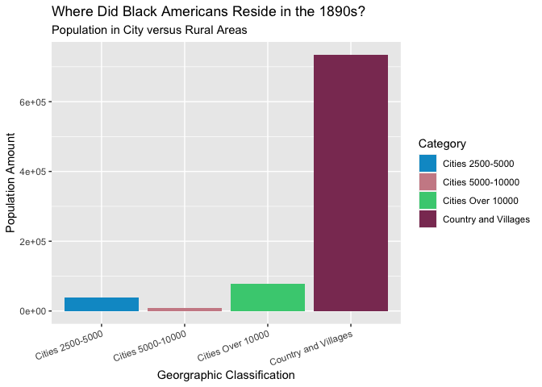
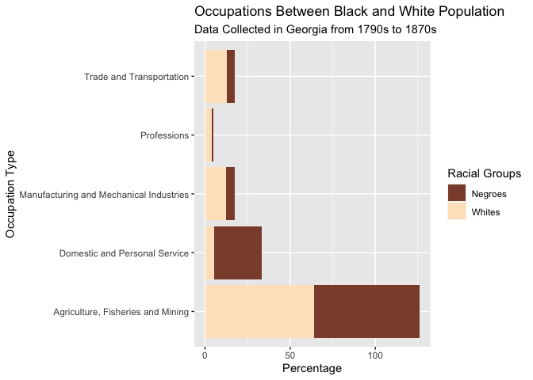

PS07
================

Michel Ruiz-Fuentes SDS192 Data Science 6 Dec. 2021

<figure>
<figcaption aria-hidden="true">“Figure 1. (2019). [Du Bois Legacy Committee Seeks Nominations for Second W.E.B. Du Bois Legacy Award] [Digital Art]. Great Barrington Massachussetts. <a href="https://www.townofgb.org/home/news/du-bois-legacy-committee-seeks-nominations-second-web-du-bois-legacy-award" class="uri">https://www.townofgb.org/home/news/du-bois-legacy-committee-seeks-nominations-second-web-du-bois-legacy-award</a>”</figcaption>
</figure>

## Inspired by W.E.B Du Bois’ Legacy to Data Viz

Last year, I was enrolled in a statistics course named “Communicating
with Data." I had an exciting experience learning how I can apply my
**passion for civic engagement, creativity, and problem-solving** in the
Statistics and Data Science department at Smith. We had several engaging
units, but our focus on accessibility was one of my favorites. In this
unit, we explored the importance of making data accessible for people of
all backgrounds. For example, we discussed designing colorblind-friendly
data visualizations by using inclusive color palettes.

This unit inspired me to search for more literature about this subject
of **equity and accessibility in data visualizations**. I found the book
“W.E.B. Du Bois’ Data Portraits: Visualizing Black America” which
includes map, graphs and charts that Du Bois and a team of black
sociologist used to illustrate the experiences of Black Americans from the 
1790-1870. Ever since I discovered the  contributions
of DuBois and his team to the data visualization world, I have been eager to explore the
intersection of data science and social science to uplift agenda focused
on social good. In Problem Set 07, I will
pursue this interest by engaging in the \#DuBoisChallenge.

## Where is the Data From

The data I am using, **W.E.B Du Bois Challenge** (published 02-16-2021),
is from TidyTuesday. The challenge came from Anthony Starks in his
article, [Recreating W.E.B Du Bois’s Data
Portraits](https://medium.com/nightingale/recreating-w-e-b-du-boiss-data-portraits-87dd36096f34).
As he describes it, the goal of the \#DuBoisChallenge is to “celebrate
the data visualization legacy of W.E.B DuBois by recreating the
visualizations from the 1900 Paris Exposition using modern tools.”

## Loading necessary package and csv files from TidyTuesday

``` r
#loading necessary packages
library(ggplot2)
library(knitr)
```

``` r
#occupation.csv (Occupation by race)
occupation <- readr::read_csv('https://raw.githubusercontent.com/rfordatascience/tidytuesday/master/data/2021/2021-02-16/occupation.csv')
```


``` r
#city\_rural.csv (Black population split between city and rural areas)
city_rural <- readr::read_csv('https://raw.githubusercontent.com/rfordatascience/tidytuesday/master/data/2021/2021-02-16/city_rural.csv')
```


## Data Visualization 1: on City-Rural Residency

``` r
ggplot(data = city_rural, mapping = aes(x=Category, y= Population, fill= Category)) + 
  geom_col() + labs(title= "Where Did Black Americans Reside in the 1890s?",
  subtitle= "Population in City versus Rural Areas") + 
  xlab("Geographic Classification") + ylab("Population Amount") +
  theme(axis.text.x = element_text(angle = 20, hjust=1)) +
  scale_fill_manual(values = c("deepskyblue3","lightpink3", "seagreen3", "hotpink4")) 
```

<!-- --> 


This bar chart is a modern visualization of the data captured by Atlanta
Univeristy and Du Bois’ in their visualization titled, [City and Rural Population
in
1890](https://medium.com/nightingale/recreating-w-e-b-du-boiss-data-portraits-87dd36096f34).
This visualization illustrates institutional racism and the highlights
disparities. How does this data convey inequities? By plotting geographic
data and where Black Americans resided in this period
we are highlighting issues associated with segregation and this
consequently also exposes unequal opportunities for Black Americans.

## Data Vizualization 2: on Occupations

``` r
ggplot(data = occupation, mapping = aes(x=Percentage, y= Occupation, fill= Group)) + 
  geom_col() + labs(title= "Occupations Between Black and White Population",
  subtitle= "Data Collected in Georgia from 1790s to 1870s",
  fill= "Racial Groups") + 
  xlab("Percentage") + ylab("Occupation Type") +
  scale_fill_manual(values = c("salmon4", "bisque1"))
```

<!-- -->

This bar chart demonstrates the differences between the types of jobs
and occupations between the [Occupations of Black and WHite People in
Georgia](https://www.loc.gov/item/2005676812/). This visualization is
vital for our analysis of inequities because it shows how certain
professions, especially ones with a reputation of paying better, were
mostly for White Americans, whereas Black Americans filled the
agricultural or domestic service roles. Our previous plot is
instrumental to this analysis because in the first visualized we assessed that the 
majority of Black Americans lived in the “Country and Village” so we can predict that 
the majority of their occupations were “Agriculture, Fisheries and
Mining” and Domestic and Personal Service" because these were the occupations
available to them.

## Conclusions

As Du Bois highlights in his data visualizations, these depictions
reveal social inequities and the effects of institutional racism. 
At the end of this challenge, the challenge creator, Anthony, said this experience taught him to use data, “to tell
compelling stories, and not to be afraid to shape your tools,” and he is
inspired by the [Du Bois
illustrations](https://www.itsnicethat.com/articles/w-e-b-du-bois-charting-black-lives-house-of-illustration-131119)
and hopes this creations can also inspire and motivate like Du Bois’
legacy has. I seek to have the same impact in PS07 and in the other
visualizations I create in the future.

## Acknowledgements

I want to thank Professor Kim, Professor Poirier, Professor Kinnaird, and Professor Blankson
for their support in building my data analysis skills!
